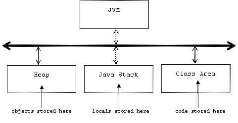
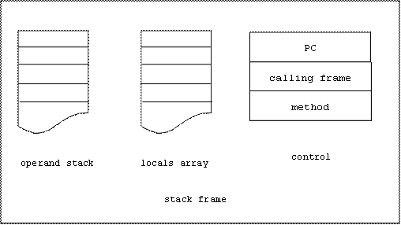

# Jasmin Instructions
## Data Control
Recall that the JVM has three storage areas:



Recall that every time a method is invoked, a stack frame is pushed onto the Java Stack. The stack frame is popped off of the stack when the method terminates.

Here's the structure of a stack frame:



Data can be stored in four places:

* **Static variables** are stored in the constant pool of the class area
* **Fields** are stored in objects that reside in the heap
* **Local variables** and **parameters** are stored in the locals array of a stack frame
* **Intermediate values** needed by operations are stored in the operands stack of a stack frame.

## Loading and Storing the Operands Stack
Loading refers to pushing data onto the operands stack.

Storing refers to popping data off of the stack and into one of the other memory areas.

### Loading constants
Loading a 32 bit constant is done with ldc. To load a 64 bit constant use `ldc2_w`:

```
ldc C             ;     . > -> <C ... >
ldcpicture12_w C          ; < ... > -> <C0 C1 ... > where C = C0C1
```

There are also instructions for pushing 8 and 16 bit constants onto the stack.
There are no instructions for storing constants (why?) but you can remove the top of an operand stack using pop:

```
pop               ;  C ... > -> < ... >
```

### Loading and Storing local variables
```
?load N           ; < ... > -> <locals[N] ... >
?store N          ; <C ... > -> < ... > && locals[N] = C
```

### Loading and Storing Fields
Assume a is the address of an object. To push a field of a onto the stack use getfield:

```
getfield CLASS/FIELD TYPE ; <a ...> -> <a.FIELD ...>
```

To load the top of the stack into a field of a use putfield:

```
putfield CLASS/FIELD TYPE ; <v a ...> -> <...> && a.FIELD = v
```

For example:

```
aload 0                      ; <...> -> <this ...>
getfield Account/balance D   ; <this ...> -> <this.balance ...>

aload 0                      ; <...> -> <this ...>
dload 500.0                  ; <this ...> -> <500.0 this...>
putfield Account/balance D   ; <500.0 this ...> -> <...> &&
                             ;this.balance = 500.0
```

Use `getstatic` & `putstatic` to load and store static fields.

Examples
```
ldc 5       ; push the 32 bit int 5 onto the operand stack
ldc 5.0     ; push the 32 bit float 5.0 onto the operand stack
ldc2_w 5    ; push the 64 bit long 5 onto the operand stack
ldc2_w 5.0  ; push the 64 bit double 5.0 onto the stack
```

If a method has parameters and local variables, these will be stored in the stack frame's locals array each time the method is invoked. The locals array is an array of 16-bit values.

```
iload 3 ; push the 32 bit int locals[3] onto the operands stack
fload 2 ; push 32 bit float in locals[2] onto operands stack
```

A 64 bit double has to be stored in two consecutive slots in the locals array:

```
; push double stored in locals[0] & locals[1] onto operands stack:
dload 0
```

To move data from the operands stack to the locals array:

```
istore 3 ; int on top of operands stack is moved to locals[3]
```
