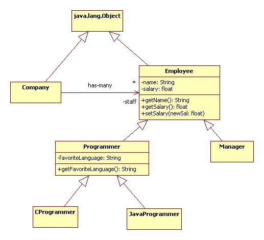
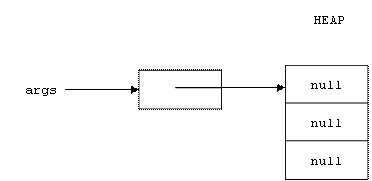
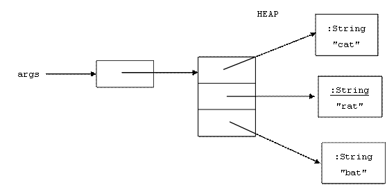

# Jasmin Instructions
## index
* [Data Control](https://github.com/momohatt/jasmin-example/blob/master/sjsu-mirror/instructions.md#data-control)
* [Arithmetic & Logic](https://github.com/momohatt/jasmin-example/blob/master/sjsu-mirror/instructions.md#arithmetic-and-logic)
* [Sequence Control](https://github.com/momohatt/jasmin-example/blob/master/sjsu-mirror/instructions.md#arithmetic-and-logic)
* [Method Invocation](https://github.com/momohatt/jasmin-example/blob/master/sjsu-mirror/instructions.md#method-invocation)
* [Creating and Using Objects](https://github.com/momohatt/jasmin-example/blob/master/sjsu-mirror/instructions.md#objects)
* [Arrays](https://github.com/momohatt/jasmin-example/blob/master/sjsu-mirror/instructions.md#arrays)

## Data Control
Recall that the JVM has three storage areas:


Recall that every time a method is invoked, a stack frame is pushed onto the Java Stack. The stack frame is popped off of the stack when the method terminates.

Here's the structure of a stack frame:


Data can be stored in four places:

* **Static variables** are stored in the constant pool of the class area
* **Fields** are stored in objects that reside in the heap
* **Local variables** and **parameters** are stored in the locals array of a stack frame
* **Intermediate values** needed by operations are stored in the operands stack of a stack frame.

## Loading and Storing the Operands Stack
Loading refers to pushing data onto the operands stack.

Storing refers to popping data off of the stack and into one of the other memory areas.

### Loading constants
Loading a 32 bit constant is done with ldc. To load a 64 bit constant use `ldc2_w`:

```
ldc C             ; < ... > -> <C ... >
ldc2_w C          ; < ... > -> <C0 C1 ... > where C = C0C1
```

There are also instructions for pushing 8 and 16 bit constants onto the stack.
There are no instructions for storing constants (why?) but you can remove the top of an operand stack using pop:

```
pop               ;  C ... > -> < ... >
```

### Loading and Storing local variables
```
?load N           ; < ... > -> <locals[N] ... >
?store N          ; <C ... > -> < ... > && locals[N] = C
```

### Loading and Storing Fields
Assume a is the address of an object. To push a field of a onto the stack use getfield:

```
getfield CLASS/FIELD TYPE ; <a ...> -> <a.FIELD ...>
```

To load the top of the stack into a field of a use putfield:

```
putfield CLASS/FIELD TYPE ; <v a ...> -> <...> && a.FIELD = v
```

For example:

```jasmin
aload 0                      ; <...> -> <this ...>
getfield Account/balance D   ; <this ...> -> <this.balance ...>

aload 0                      ; <...> -> <this ...>
dload 500.0                  ; <this ...> -> <500.0 this...>
putfield Account/balance D   ; <500.0 this ...> -> <...> &&
                             ;this.balance = 500.0
```

Use `getstatic` & `putstatic` to load and store static fields.

Examples
```jasmin
ldc 5       ; push the 32 bit int 5 onto the operand stack
ldc 5.0     ; push the 32 bit float 5.0 onto the operand stack
ldc2_w 5    ; push the 64 bit long 5 onto the operand stack
ldc2_w 5.0  ; push the 64 bit double 5.0 onto the stack
```

If a method has parameters and local variables, these will be stored in the stack frame's locals array each time the method is invoked. The locals array is an array of 16-bit values.

```jasmin
iload 3     ; push the 32 bit int locals[3] onto the operands stack
fload 2     ; push 32 bit float in locals[2] onto operands stack
```

A 64 bit double has to be stored in two consecutive slots in the locals array:

```jasmin
; push double stored in locals[0] & locals[1] onto operands stack:
dload 0
```

To move data from the operands stack to the locals array:

```jasmin
istore 3 ; int on top of operands stack is moved to locals[3]
```

## Arithmetic and Logic

Processors are either register machines or stack machines.

In a register machine a typical instruction must specify the operator, the source registers that hold the operands (the inputs) and the destination register that will hold the result (the output). For example:

```asm
add R0, R1, R2    ; R0 = R1 + R2
```

Or on some machines:

```asm
add R0, R1        ; R0 = R0 + R1
```

In a stack machine the sources and destinations are understood to reside on a stack, and therefore do not need to be specified. Only the operator is needed. For example:

```asm
add               ; replace top 2 items on stack by their sum
```

The JVM is a stack machine. The operands for all of the arithmetic and logic instructions that occur in the body of a method are understood to reside in the operands stack contained in the stack frame created each time the method is invoked.

For example, the sequence of instructions pushes 6 and 7 onto the operands stack, then replaces them by their product, 42:

```jasmin
ldc 6
ldc 7
imul
```

We can represent this formally as:

```jasmin
ldc 6   ; <6 ...>
ldc 7   ; <7 6 ...>
imul    ; <42 ...>
```

Actually, there are many multiplication instructions, one for each type of number.

We can specify the semantics of all multiplication instructions as follows:

```jasmin
?mul     ; <a b ...> -> <a * b ...>
```

Where:

```
stack = <a b ...>
? = a, d, f, i, l
```

### Arithmetic Instructions
```jasmin
?add  ; <a b ...> -> <a + b ...>
?div  ; <a b ...> -> <b/a ...>
?mul  ; <a b ...> -> <a * b ...>
?rem  ; <a b ...> -> <b%a ...>
?sub  ; <a b ...> -> <b - a ...>
?neg  ; <a ...> -> <-a ...>
```

### Bitwise Instructions
The shift instructions only work for * = i or * = l

```jasmin
*and  ; <a b ...> -> <a & b ...>
*or   ; <a b ...> -> <a | b ...>
*xor  ; <a b ...> -> <a ^ b ...>
*shl  ; <a b ...> -> <a << b ...>
*ushr ; <a b ...> -> <a >> b ...>
```

### Data Conversion Instructions
For example:

```jasmin
i2f   ; <a ...> -> <a' ...> where a' is the floating point representation of the int a
```

In general:

```jasmin
?2?   ; <a ...> -> <a' ...> where a' is a represeentation of a in another type
```

For example:

```jasmin
i2b, i2c, i2d, i2f, i2l, i2s
```

Not all combinations are supported. Some combinations are specified but not supported in certain implementations.

* We can always convert to and from int
* We can always convert between the big four: int, fload, long, double
* A conversion such as `b2i` is automatic
* `f2c` needs to be done as `f2i`, `i2c`
* Conversion to sub-word types can loose information.
* Converting from a 32-bit quantity to a 64-bit quantity increases the size of the stack.

### References
See Appendix B of your text for a complete list of the Jasmin instructions and their byte codes.

## Sequence Control
### Sequence control in Java
Here are the Java control instructions:

```
conditionals
    if
    if/else
    switch
iterations
    for
    while
    do/while
escapes
    return
    throw
    break
    continue
    System.exit
```

See [Sequence Control in Java](http://www.cs.sjsu.edu/~pearce/modules/lectures/j2se/intro/lectures/control.htm) for more details.

### Sequence control in Jasmin
A Jasmin instruction begins with an optional label:

LABEL: OPERATOR OPERAND(S) ; COMMENT

Labels are simply a convenient way to refer to the labeled instruction's address in the computer's memory.

(Recall in the JVM instructions are contained in methods which are contained in classes which are contained in the class area of the JVM's memory.)

A labeled instruction can be the target of an unconditional or conditional goto instruction:

goto LABEL ; PC = LABEL

Executing a goto instruction simply alters the PC (program counter).

Goto instructions are also called branches or jumps.

#### Unconditional goto
Use an unconditional goto to set up a perpetual loop:

```jasmin
Prompt:
    ; prompt user for command
    ; execute command
    ; display result
    goto Prompt ; PC = Prompt
```

#### Conditional gotos
A conditional goto first executes a comparison. If the comparison is true, then the PC is altered, otherwise control falls to the subsequent instruction.

##### Comparing ints to 0
Assume a is an int sitting on top of the operand stack.

```jasmin
ifeq LABEL ; <a ... > -> <...> if (a == 0) goto LABEL
ifge LABEL ; <a ... > -> <...> if (a >= 0) goto LABEL
ifgt LABEL ; <a ... > -> <...> if (a > 0) goto LABEL
ifle LABEL ; <a ... > -> <...> if (a <= 0) goto LABEL
iflt LABEL ; <a ... > -> <...> if (a < 0) goto LABEL
ifne LABEL ; <a ... > -> <...> if (a != 0) goto LABEL
```

##### Comparing two ints
The result of comparing two ints is not explicitly stored, instead the program jumps to a specified label:

```jasmin
if_icmpeq LABEL ; <a b...> -> <...> if (a == b) goto LABEL
if_icmpne LABEL ; <a b...> -> <...> if (a != b) goto LABEL
if_icmplt LABEL ; <a b...> -> <...> if (b < a) goto LABEL
if_icmpge LABEL ; <a b...> -> <...> if (b >= a) goto LABEL
if_icmpgt LABEL ; <a b...> -> <...> if (b > a) goto LABEL
if_icmple LABEL ; <a b...> -> <...> if (b <= a) goto LABEL
```

##### Comparing other types of data
Conditional branches for other types of data require two instructions. The first instruction is a comparison that replaces two items off the stack with 1, 0, or -1 depending on if the second from top element is `>`, `==`, or `<` the top element. Another way to think about it, the compare instruction is like the subtract instruction:

```jasmin
?sub  ; <a b ...> -> <b - a ...>
```

except instead of the difference, the sign (1 = positive, 0 = 0, -1 = negative) of the difference is pushed onto the stack.

Assume a and b are longs

```jasmin
lcmp ; <a b ...> -> <c ...> where c = 1 if b > a, 0 if b == a, or -1
```

For floating point numbers (? = f or d) things are more complicated because either (or both) of the numbers could be NaN (not a number). In this case 1 or -1 is pushed on the stack:

```
?cmpg ; <a b ...> -> <c ...> where c = 1 if b > a or b == NaN or a = NaN, 0 if b == a, or -1
?cmpl ; <a b ...> -> <c ...> where c = 1 if b > a, 0 if b == a, or -1 if b < a or b = NaN or a = NaN
```

The following instructions assume a is an address (recall that null = address 0):

```
ifnonull LABEL  ; <a ... > -> <...> if (a != null) goto LABEL
ifnull LABEL    ; <a ... > -> <...> if (a == null) goto LABEL
```

#### Return
Recall that a stack frame contains three control variables:

* PC : next instruction to be executed
* CF : stack frame of the calling method
* METH : the current method

The JVM keeps a pointer to the top-most frame on the Java stack (TOP). This is the stack frame of the currently executing method.

The return instruction is used to return the top item on the operand stack to the caller. It also sets TOP to CF.

```jasmin
?return   ; <a...> -> <...> && a (and control) is returned to the caller
```

### Constructing Control Structures
#### Compiling Conditionals
Here's a typical Java if/else instruction:

```java
if (a > 5) {
    u;v;w;
} else {
    x;y;z;
}
m; n; k;
```

Assume `a` is an int stored in `locals[1]`, here's how the above instruction would be compiled into Jasmin:

```jasmin
    iload 1         ; <...> -> <a...>
    ldc 5           ; <a...> -> <5 a ...>
    if_icmple ELSE  ; <5 a...> -> <...> if (a <= 5) goto ELSE
    u; v; w;
    goto NEXT       ; PC = NEXT
ELSE:
    x; y; z;
NEXT:
    m; n; k;
```

How would this need to be altered if a was a long, float, or double?

#### Compiling Iterations
First observe that Java's for and do/while and for instructions can be compiled to Java's while instruction (see [Iterations in Java](http://www.cs.sjsu.edu/~pearce/modules/lectures/j2se/intro/lectures/Iterations.htm)).

Therefore we only need to worry about compiling while loops into Jasmin.

For example, consider the Java statement:

```java
while(a > 5) {
    u; v; w;
}
m; n; k;
```

Assume `a` is an int stored in `locals[1]`, here's how the above instruction would be compiled into Jasmin:

```jasmin
TOP:
    iload 1         ; <...> -> <a...>
    ldc 5           ; <a...> -> <5 a ...>
    if_icmple NEXT  ; <5 a...> -> <...> if (a <= 5) goto NEXT
    u; v; w;
    goto TOP        ; PC = TOP
NEXT:
    m; n; k;
```

How would this need to be altered if a was a long, float, or double?

### Demos
* [Functions.java](https://github.com/momohatt/jasmin-example/tree/master/sjsu-mirror/demo/Functions/Functions.java)
* [TestFunctions.java](https://github.com/momohatt/jasmin-example/tree/master/sjsu-mirror/demo/Functions/TestFunctions.java)
* [Functions.j](https://github.com/momohatt/jasmin-example/tree/master/sjsu-mirror/demo/Functions/Functions.j)

## Method Invocation
### Invoking Static Methods
To invoke a static method, push all of the arguments onto the stack, then execute:

```jasmin
invokestatic METHOD  ; <c b a...> -> <d...> where d = METHOD(a, b, c)
```

Here `METHOD` is the fully qualified signature of the method to be invoked:

```
PACKAGE/CLASS/METHOD(PARAM TYPES)TYPE
```

After this instruction the return value should be on top of the stack.

Executing this instruction pops the arguments off the stack, creates a new stack frame, pushes the arguments onto that stack, and sets the PC to the first instruction of the method.

#### Example
The following instruction sequence computes `Math.sin(pi/4)` where `pi` = 3.1416:

```jasmin
ldc2_w 3.1416
ldc2_w 4.0
ddiv
invokestatic java/lang/Math/sin(D)D
```

#### Example
Recall the definition of the static factorial function (n!) given in [Functions.java](https://github.com/momohatt/jasmin-example/tree/master/sjsu-mirror/demo/Functions/Functions.java).

The following instruction sequence loads `Functions.fact(4)` into `locals[0]`:

```jasmin
ldc 4
invokestatic Functions/fact(I)I
istore 0
```

### Loading & Storing Fields
Pushing a field onto the stack is done with

```jasmin
getfield Class/Field Type
getstatic Class/Fieeld Type
```

Storing the top of the stack into a field is done with

```jasmin
putfield Class/Field Type
putstatic Class/Field Type
```

### Invoking non-Static Methods
To invoke a non-static method, push the object that invokes the method onto the stack (this) along with any other explicit arguments, then execute:

```jasmin
invokevirtual METHOD  ;<c b a...> -> <d...> where d = a.METHOD(b, c)
```

After this instruction the return value should be on top of the stack.

Executing this instruction pops the arguments off the stack, creates a new stack frame, pushes the arguments onto that stack, and sets the PC to the first instruction of the method.

#### Example
The Java method invocation:

```java
System.out.println("Hello World!");
```

is translated into Jasmin as:

```jasmin
getstatic java/lang/System/out Ljava/io/PrintStream;
ldc "Hello World!"
invokevirtual java/io/PrintStream/println(Ljava/lang/String;)V
```

#### Example
The Java method invocation:

```java
Math.sin(Math.PI/4);
```

is translated into Jasmin as:

```jasmin
getstatic java/lang/Math/PI D
ldc2_w 4.0
ddiv
invokestatic java/lang/Math/sin(D)D
```

#### Example
Recall the temperature conversion calculator defined in [Calculator.java](https://github.com/momohatt/jasmin-example/blob/master/sjsu-mirror/demo/Calculator/Calculator.java).

The following sequence assumes a reference to a `Calculator` object is stored in `locals[1]` After the call the centigrade value of 98.6 degrees is stored in `locals[2]`:

```jasmin
aload 1
ldc 98.6
invokevirtual Calculator/f2c(F)F
fstore 2
```

### invokespecial
Invoke special is similar to invokevirtual, but is used in tricky situations such as invoking constructors:

```jasmin
.method public <init>()V
   aload_0 ; push this
   invokespecial java/lang/Object/<init>()V ; call super
   return
.end method
```

### Demos
Until now we have been invoking Jasmin methods in Java. We can reverse this.

Recall [Functions.java](https://github.com/momohatt/jasmin-example/blob/master/sjsu-mirror/demo/Functions/Functions.java) contained several static methods. In [TestFunctions.j](https://github.com/momohatt/jasmin-example/blob/master/sjsu-mirror/demo/Functions/TestFunctions.j) we invoke these methods.

Recall the Fahrenheit-Centigrade calculator: [Calculator.java](https://github.com/momohatt/jasmin-example/blob/master/sjsu-mirror/demo/Calculator/Calculator.java)
We test these functions in [TestCalculator.j](https://github.com/momohatt/jasmin-example/blob/master/sjsu-mirror/demo/Calculator/TestCalculator.j).

### Recursion
A recursive function is a function that calls itself!

Why wouldn't this cause an infinite loop? Why wouldn't f(n) call f(n) call f(n) ...?

It would. Normally f(n) calls f(n - 1) calls f(n - 2) ... calls f(0).

But instead of calling f(-1), f(0) terminates the recursion by returning the answer.

For example, here's a recursive definition of the factorial function:

```java
class RecursiveFunctions {
    public static int fact(int n) {
        if (n <= 0) {
            return 1;
        } else {
            return n * fact(n � 1);
        }
    }
}
```

Let's trace a call:

RecursiveFunctions.fact(4)
4 * RecursiveFunctions.fact(3)
4 * 3 * RecursiveFunctions.fact(2)
4 * 3 * 2 * RecursiveFunctions.fact(1)
4 * 3 * 2 * 1 * RecursiveFunctions.fact(0)
4 * 3 * 2 * 1 * 1
4 * 3 * 2 * 1
4 * 3 * 2
4 * 6
24

Sometimes recursive functions are easier to write than non-recurive functions.

In the example above we get to assume fact(n - 1) works properly. We don't need to know how it works. We only need to know how to compute fact(n) from fact(n - 1). The answer: multiply by n!

Of course we also need to know fact(0).

Compilers often depend on recursion. For example, to compile a program n lines long, translate the first line into the the target language, then append to this the result of recursively compiling the remaining n � 1 lines:

```java
Compliler {
    Program compile(Program p) {
        if (length(p) == 0) {
            return null; // nothing to do!
        } else {
            Instruction q0 = translate(head(p));
            Program q = compile(tail(p));
            return append(q0, q);
        }
    }
}
```

See [RecursiveFunctions.j](https://github.com/momohatt/jasmin-example/tree/master/sjsu-mirror/demo/Functions/RecursiveFunctions.j) for the recursive Jasmin definition of the factorial function.

recursively compile the first n - 1 lines, then figure out how to translate the last line.

## Objects

### Objects and Classes in Java
#### Objects
An object is a container of named variables that lives in the heap.

The variables contained by an object are called the object's fields, attributes, member variables, or instance variables.

Each variable in an object can be referenced by its qualified name: `object.variable`

##### Example
Assume bank accounts are represented by objects containing one field of type float: balance.

Assume savings and checking are two objects representing my savings and checking accounts, respectively. Then:

```
savings.balance = the balance of my savings account
checking.balance = the balance of my checking account
```

##### Example
Assume rational numbers are represented by objects containing two integer fields: `numerator` and `denominator`.

Assume `rat1` represents the rational number 3/4 and `rat2` represents 4/5. Then:

```java
rat1.numerator = 3
rat1.denominator = 4

rat2.numerator = 4
rat2.denominator = 5
```

#### Classes
A class is a container of variable and method declarations.

Don't confuse variables and variable declarations.

Don't confuse methods and method declarations.

##### Examples
* [Account.java](https://github.com/momohatt/jasmin-example/blob/master/sjsu-mirror/demo/Account/Account.java)
* [Rational.java](https://github.com/momohatt/jasmin-example/blob/master/sjsu-mirror/demo/Rational.java)

A class is a template for creating objects.

##### Example
Here's what's going on in the following lines:

```java
Rational rat1 = new Rational(3, 4);
Rational rat2 = new Rational(4, 5);
Account checking = new Account();
Account savings = new Account();
```

In the first two lines two objects are created in the heap. Each object contains two integer variables named numerator and denominator. References to these objects are stored in rat1 and rat2 respectively.

In the second two lines two more objects are created in the heap. Each object contains a variable named balance of type float.

We ask an object to execute a method with the following syntax:

```java
Rational rat3 = rat1.mul(rat2);
savings.deposit(500);
```

We can consider `rat1` and `savings` as implicit arguments to `mul` and `deposit`, respectively. In a non-object-oriented language these might be explicit arguments:

```
Rational rat3 = mul(rat1, rat2);
deposit(savings, 500);
```

The corresponding implicit parameter is always named this.

By using implicit arguments, instances (objects) of the same class can share methods.

### Objects and Classes in Jasmin
#### Creating Objects
The following sequence of instructions creates and initializes a new instance of `CLASS`:

```jasmin
new CLASS                       ; <...> -> <a...> where a = reference to new object in heap
dup                             ; <a...> -> <a a...>
invokespecial CLASS/<init>()V   ; <a a...> -> <a...>
```

The first instruction allocates a new object in the heap and pushes an address to this now object onto the operands stack.

The last instruction invokes the default constructor to initialize the fields of the newly allocated object. Unfortunately, it pops the stack. Therefore it is necessary to push a duplicate copy of the address on the stack. This is the function of the second instruction.

##### Example
The Java statement:

```java
new java.awt.Rectangle(50, 30); // creates rectangle with width 50 and height 30 at (0, 0)
```

is translated into Jasmin as:

```jasmin
new java/awt/Rectangle
dup
ldc 50
ldc 30
invokespecial java/awt/Rectangle/<init>(II)V
```

##### Example
Continuing from the previous example, the following sequence of Jasmin instructions moves the (upper left corner of the) rectangle from (0, 0) to (10, 15):

```jasmin
dup
ldc 10
ldc 15
invokevirtual java/awt/Rectangle/setLocation(II)V
```

##### Example
Continuing from the previous example, the following sequence of Jasmin instructions converts the rectangle into a string and stores it in `locals[0]`:

```jasmin
invokevirtual java/awt/Rectangle/toString()Ljava/lang/String;
astore 0
```

##### Example
Continuing from the previous example, the following sequence of Jasmin instructions uses `System.out.println` to print the string stored in `locals[0]`:

```jasmin
getstatic java/lang/System/out Ljava/io/PrintStream;
aload 0
invokevirtual java/io/PrintStream/println(Ljava/lang/String;)V
```

Here's the output produced:

```
java.awt.Rectangle[x=10,y=15,width=50,height=30]
```

##### Example
Recall the Account class declared in [Account.java](https://github.com/momohatt/jasmin-example/blob/master/sjsu-mirror/demo/Account/Account.java).

Here's how a new Account instance is created and initialized:

```jasmin
new Account                     ; <...> -> <a...> where a = ref to new Account
dup                             ; <a...> -> <a a...>
invokespecial Account/<init>()V ; call constructor
```

##### Example
Continuing from the previous example, the following sequence of Jasmin instructions deposits $50 into this account:

```jasmin
dup
ldc2_w 50.0
invokevirtual Account/deposit(D)V
```

#### Classes
Suppose the file `Car.java` contains the following class declaration:

```
public class Car extends Vehicle implements Carrier {
    private double speed;
    public void start() {
        // etc.
    }
}
```

A compiler that translated Java to Jasmin would translate `Car.java` into a file called `Car.j` that looked like this:

```jasmin
.class public Car       ; public class Car 
.super Vehicle          ; extends Vehicle
.implements Carrier     ; implements Carrier
.field private speed D  ; private double speed;

; default constructor
.method public <init>()V
    .limit stack 3
    .limit locals 1

    // call super()
    aload_0 ; push this

    invokespecial Vehicle()V
    ; init speed to 0.0
    aload 0
    ldc2_w 0.0
    putfield Car/speed D

    return
.end method

.method public start()V
    .limit stack 4      ; start requires a 4 word stack
    .limit locals 2     ; start requires space for 2 locals
    ; instruction go here
.end method
```

Assembling the file would create a file called `Car.class`.

##### Examples
* [Account.java](https://github.com/momohatt/jasmin-example/blob/master/sjsu-mirror/demo/Account/Account.java) or [Account.j](https://github.com/momohatt/jasmin-example/blob/master/sjsu-mirror/demo/Account/Account.j)
* [TestAccount.j](https://github.com/momohatt/jasmin-example/blob/master/sjsu-mirror/demo/Account/TestAccount.j)
* [TestJava.j](https://github.com/momohatt/jasmin-example/blob/master/sjsu-mirror/demo/TestJava.j)

### Inheritance
Recall that one of the strengths of Object-Oriented Programming is the ability to define a class as an extension of an existing class. In this case the new or derived class inherits all of the fields and methods of the existing or base class.

Of course the inherited fields and methods may have been explicitly declared by the super class or inherited from its base class.

More formally, class A is a subclass of class B if:

* A = B (i.e., a class is a subclass of itself)
* A extends B
* A extends C and C is a subclass of B

If A is a subclass of B, then we can also say that B is a superclass of A.

If A is a subclass of B, then A inherits all of the fields and methods of B.

If A is a subclass of B, then instances of A can be used in contexts where instances of B are expected. We say that instances of A can masquerade as instances of B.

For example:

```java
B b = new A(); // an instance of A masquerading as an instance of B
```

#### UML Notation


How many subclasses does Employee have?

Java Implementation
* [Employee.java](https://github.com/momohatt/jasmin-example/blob/master/sjsu-mirror/demo/Company/Employee.java)
* [Programmer.java](https://github.com/momohatt/jasmin-example/blob/master/sjsu-mirror/demo/Company/Programmer.java)
* [Company.java](https://github.com/momohatt/jasmin-example/blob/master/sjsu-mirror/demo/Company/Company.java)

Jasmin Implementation
* [Employee.j](https://github.com/momohatt/jasmin-example/blob/master/sjsu-mirror/demo/Company/Employee.j)
* [Programmer.j](https://github.com/momohatt/jasmin-example/blob/master/sjsu-mirror/demo/Company/Programmer.j)

### Format of a .class file
A .class file consists of seven tables:

1. version
    magic number
    minor version
    major version
2. constant pool
    count
    constants
3. class
    access flags (public, final, super, interface, abstract)
    class name
    super class name
4. interfaces
    count
    interfaces implemented
5. fields
    count
    fields
6. methods
    count
    methods
7. attributes
    count
    attributes (for example bytecodes of methods are here)

### The Class Loader
The JVM class loader:

```java
Class.forName("MyClass.class")
```

locates the file `MyClass.class` and loads it into memory.

It validates the code in `MyClass.class`, returning an error if anything looks suspicious.

It creates a class object representing MyClass and stores it in the class area.

## Arrays

### Arrays in Java
Arrays in Java are discussed in [Java Arrays](http://www.cs.sjsu.edu/~pearce/modules/lectures/j2se/intro/lectures/arrays/index.html).

Java's primitive data types are: boolean, byte, char, short, int, long, float, double.

Everything else (objects and arrays) are called **reference types**.

In fact, an array can be considered a special type of `object`.

A reference is an address of the start of an object or array in the heap.

We can summarize with a formal grammar:

```
TYPE ::= PRIMITIVE | REFERENCE
PRIMITIVE ::= boolean | NUMBER
NUMBER ::= EXACT | INEXACT
EXACT ::= byte | char | short | int | long
INEXACT ::= float | double
REFERENCE ::= Object | TYPE[] (i.e., an array)
```

#### Example:
The following declaration creates a 32 bit variable named args initialized by null (address `0x00000000`):

```java
String[] args;
```

We can draw a picture of memory using a box & pointer diagram. Boxes represent variables (data containers), pointers represent references:


Note: At this point no array has been created.

Where does the variable named args live? If it's a parameter or local variable, then it will live in a stack frame on the Java stack. If it's a non-static field, then it will live in the heap. If it is a static field, then it will live in the class area.

Here's how the array is created in Java:

```java
args = new String[3];
```

Here's the box & pointer diagram now:



Note that the new operator, which allocates memory in the heap, is used to create arrays and objects.

Note that the array is simply three consecutive 32-bit variables in the heap.

Each variable can hold the address of a string, which is a type of object.

Note that no strings have been created. Each variable in the array is initialized by null.

Next we fill the array:

```java
args[0] = new String("cat");
args[1] = new String("rat");
args[2] = new String("bat");
```

Here's the box & pointer diagram:



Note: The expression `args[0]` is pronounced "args sub-zero".

Note: 0, 1, and 2 are called **indices**.

Note: indices always start at 0, so while the length of args is 3, the largest valid index is only 2. Tricky!

The following code **traverses** the array and **processes** (in this case prints) each **element**:

```java
for(int i = 0; i < args.length; i++) {
    System.out.println(args[i]);
}
```

Note that `args.length` is the capacity of the array, not necessarily the number of non-null elements.

Suppose the following assignment statement is executed:

```java
args = null;
```

Here's the box & pointer diagram:


The JVM keeps track of the reference count of every object (and array) in the heap. This is the number of chains references (pointers) to the object that originate from outside of the heap. When the reference count of an object (or array) is zero, then the object is inaccessible. Inaccessible objects are called **garbage**.

When the heap runs low on free space a program called the garbage collector (`System.gc()`) is automatically run by the JVM. This program recycles all of the garbage in the heap. In other words, the bytes in the array like the one above will be added to the free space where they can potentially be reallocated by subsequent calls to the new operator.

### Arrays in Jasmin
#### Creating Arrays
```jasmin
newarray type  ; <c ... > -> <a ... > where a = new type[c]
```
For example, the following instructions create an array of 1000 ints:

```jasmin
ldc 1000
newarray int  ; note "int" not "I"
```

These instructions create an array of 1000 references to strings:

```jasmin
ldc 1000
anewarray java/lang/String
```

#### Multi-dimensional arrays
There is also an instruction for creating multi-dimensional arrays (i.e. arrays of array of arrays of ...):

```jasmin
multianewarray
```

#### Type Notation
The notation for an array type is strange. For example:

```
[I = array of integers = int[] in Java
```

#### Storing an item into an array
```jasmin
?astore ; <a b c ...> -> <...> c[b] = a
```

#### Retrieving an item from an array
```jasmin
?aload  ; <a b ...> -> <b[a] ... >
```
where
```
? = i | f | d | l | a | b (= byte or boolean)
```

#### Determining the length of an array
```jasmin
arraylength  ; <a ... > -> <a.length ... >
```

#### Destroying an array: Garbage Collection (gc)
As explained earlier, when the reference count of an array reaches 0, then the garbage collector will recycle the array and all garbage elements. (Could a garbage array contain a non-garbage element? Give an example of how this could happen.)

#### Processing Arrays
A container is an object that, among other possible duties, contains data.

The data contained in a container are called the container's elements.

A container usually provides users with methods for:

* adding new elements
* removing elements
* accessing individual elements
* finding out the number of elements

An array is a container.

A linked list is a container.

A container can be more abstract. For example:

* A company is an employee container
* A control panel is a button container
* A school is a student container

In the following example an exam is a score container.

* [Exam.java](https://github.com/momohatt/jasmin-example/tree/master/sjsu-mirror/demo/Exam/Exam.java)
* [TestExam.java](https://github.com/momohatt/jasmin-example/tree/master/sjsu-mirror/demo/Exam/TestExam.java)
* [Exam.j](https://github.com/momohatt/jasmin-example/tree/master/sjsu-mirror/demo/Exam/Exam.j)
