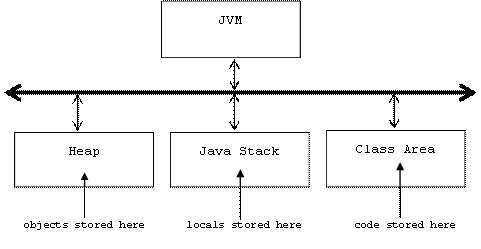
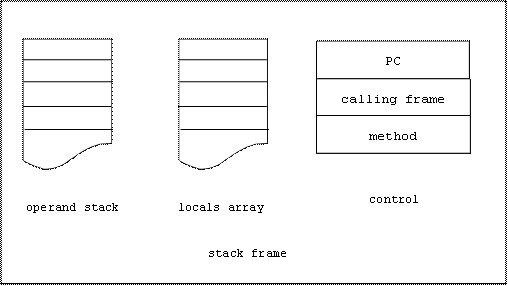

# Jasmin Instructions
## Data Control
Recall that the JVM has three storage areas:



Recall that every time a method is invoked, a stack frame is pushed onto the Java Stack. The stack frame is popped off of the stack when the method terminates.

Here's the structure of a stack frame:



Data can be stored in four places:

* **Static variables** are stored in the constant pool of the class area
* **Fields** are stored in objects that reside in the heap
* **Local variables** and **parameters** are stored in the locals array of a stack frame
* **Intermediate values** needed by operations are stored in the operands stack of a stack frame.

## Loading and Storing the Operands Stack
Loading refers to pushing data onto the operands stack.

Storing refers to popping data off of the stack and into one of the other memory areas.

### Loading constants
Loading a 32 bit constant is done with ldc. To load a 64 bit constant use `ldc2_w`:

```
ldc C             ; < ... > -> <C ... >
ldc2_w C          ; < ... > -> <C0 C1 ... > where C = C0C1
```

There are also instructions for pushing 8 and 16 bit constants onto the stack.
There are no instructions for storing constants (why?) but you can remove the top of an operand stack using pop:

```
pop               ;  C ... > -> < ... >
```

### Loading and Storing local variables
```
?load N           ; < ... > -> <locals[N] ... >
?store N          ; <C ... > -> < ... > && locals[N] = C
```

### Loading and Storing Fields
Assume a is the address of an object. To push a field of a onto the stack use getfield:

```
getfield CLASS/FIELD TYPE ; <a ...> -> <a.FIELD ...>
```

To load the top of the stack into a field of a use putfield:

```
putfield CLASS/FIELD TYPE ; <v a ...> -> <...> && a.FIELD = v
```

For example:

```jasmin
aload 0                      ; <...> -> <this ...>
getfield Account/balance D   ; <this ...> -> <this.balance ...>

aload 0                      ; <...> -> <this ...>
dload 500.0                  ; <this ...> -> <500.0 this...>
putfield Account/balance D   ; <500.0 this ...> -> <...> &&
                             ;this.balance = 500.0
```

Use `getstatic` & `putstatic` to load and store static fields.

Examples
```jasmin
ldc 5       ; push the 32 bit int 5 onto the operand stack
ldc 5.0     ; push the 32 bit float 5.0 onto the operand stack
ldc2_w 5    ; push the 64 bit long 5 onto the operand stack
ldc2_w 5.0  ; push the 64 bit double 5.0 onto the stack
```

If a method has parameters and local variables, these will be stored in the stack frame's locals array each time the method is invoked. The locals array is an array of 16-bit values.

```jasmin
iload 3     ; push the 32 bit int locals[3] onto the operands stack
fload 2     ; push 32 bit float in locals[2] onto operands stack
```

A 64 bit double has to be stored in two consecutive slots in the locals array:

```jasmin
; push double stored in locals[0] & locals[1] onto operands stack:
dload 0
```

To move data from the operands stack to the locals array:

```jasmin
istore 3 ; int on top of operands stack is moved to locals[3]
```

## Arithmetic and Logic

Processors are either register machines or stack machines.

In a register machine a typical instruction must specify the operator, the source registers that hold the operands (the inputs) and the destination register that will hold the result (the output). For example:

```asm
add R0, R1, R2    ; R0 = R1 + R2
```

Or on some machines:

```asm
add R0, R1        ; R0 = R0 + R1
```

In a stack machine the sources and destinations are understood to reside on a stack, and therefore do not need to be specified. Only the operator is needed. For example:

```asm
add               ; replace top 2 items on stack by their sum
```

The JVM is a stack machine. The operands for all of the arithmetic and logic instructions that occur in the body of a method are understood to reside in the operands stack contained in the stack frame created each time the method is invoked.

For example, the sequence of instructions pushes 6 and 7 onto the operands stack, then replaces them by their product, 42:

```jasmin
ldc 6
ldc 7
imul
```

We can represent this formally as:

```jasmin
ldc 6   ; <6 ...>
ldc 7   ; <7 6 ...>
imul    ; <42 ...>
```

Actually, there are many multiplication instructions, one for each type of number.

We can specify the semantics of all multiplication instructions as follows:

```jasmin
?mul     ; <a b ...> -> <a * b ...>
```

Where:

```
stack = <a b ...>
? = a, d, f, i, l
```

### Arithmetic Instructions
```jasmin
?add  ; <a b ...> -> <a + b ...>
?div  ; <a b ...> -> <b/a ...>
?mul  ; <a b ...> -> <a * b ...>
?rem  ; <a b ...> -> <b%a ...>
?sub  ; <a b ...> -> <b - a ...>
?neg  ; <a ...> -> <-a ...>
```

### Bitwise Instructions
The shift instructions only work for * = i or * = l

```jasmin
*and  ; <a b ...> -> <a & b ...>
*or   ; <a b ...> -> <a | b ...>
*xor  ; <a b ...> -> <a ^ b ...>
*shl  ; <a b ...> -> <a << b ...>
*ushr ; <a b ...> -> <a >> b ...>
```

### Data Conversion Instructions
For example:

```jasmin
i2f   ; <a ...> -> <a' ...> where a' is the floating point representation of the int a
```

In general:

```jasmin
?2?   ; <a ...> -> <a' ...> where a' is a represeentation of a in another type
```

For example:

```jasmin
i2b, i2c, i2d, i2f, i2l, i2s
```

Not all combinations are supported. Some combinations are specified but not supported in certain implementations.

* We can always convert to and from int
* We can always convert between the big four: int, fload, long, double
* A conversion such as `b2i` is automatic
* `f2c` needs to be done as `f2i`, `i2c`
* Conversion to sub-word types can loose information.
* Converting from a 32-bit quantity to a 64-bit quantity increases the size of the stack.

### References
See Appendix B of your text for a complete list of the Jasmin instructions and their byte codes.

## Sequence Control
### Sequence control in Java
Here are the Java control instructions:

```
conditionals
    if
    if/else
    switch
iterations
    for
    while
    do/while
escapes
    return
    throw
    break
    continue
    System.exit
```

See [Sequence Control in Java](http://www.cs.sjsu.edu/~pearce/modules/lectures/j2se/intro/lectures/control.htm) for more details.

### Sequence control in Jasmin
A Jasmin instruction begins with an optional label:

LABEL: OPERATOR OPERAND(S) ; COMMENT

Labels are simply a convenient way to refer to the labeled instruction's address in the computer's memory.

(Recall in the JVM instructions are contained in methods which are contained in classes which are contained in the class area of the JVM's memory.)

A labeled instruction can be the target of an unconditional or conditional goto instruction:

goto LABEL ; PC = LABEL

Executing a goto instruction simply alters the PC (program counter).

Goto instructions are also called branches or jumps.

#### Unconditional goto
Use an unconditional goto to set up a perpetual loop:

```jasmin
Prompt:
    ; prompt user for command
    ; execute command
    ; display result
    goto Prompt ; PC = Prompt
```

#### Conditional gotos
A conditional goto first executes a comparison. If the comparison is true, then the PC is altered, otherwise control falls to the subsequent instruction.

##### Comparing ints to 0
Assume a is an int sitting on top of the operand stack.

```jasmin
ifeq LABEL ; <a ... > -> <...> if (a == 0) goto LABEL
ifge LABEL ; <a ... > -> <...> if (a >= 0) goto LABEL
ifgt LABEL ; <a ... > -> <...> if (a > 0) goto LABEL
ifle LABEL ; <a ... > -> <...> if (a <= 0) goto LABEL
iflt LABEL ; <a ... > -> <...> if (a < 0) goto LABEL
ifne LABEL ; <a ... > -> <...> if (a != 0) goto LABEL
```

##### Comparing two ints
The result of comparing two ints is not explicitly stored, instead the program jumps to a specified label:

```jasmin
if_icmpeq LABEL ; <a b...> -> <...> if (a == b) goto LABEL
if_icmpne LABEL ; <a b...> -> <...> if (a != b) goto LABEL
if_icmplt LABEL ; <a b...> -> <...> if (b < a) goto LABEL
if_icmpge LABEL ; <a b...> -> <...> if (b >= a) goto LABEL
if_icmpgt LABEL ; <a b...> -> <...> if (b > a) goto LABEL
if_icmple LABEL ; <a b...> -> <...> if (b <= a) goto LABEL
```

##### Comparing other types of data
Conditional branches for other types of data require two instructions. The first instruction is a comparison that replaces two items off the stack with 1, 0, or -1 depending on if the second from top element is `>`, `==`, or `<` the top element. Another way to think about it, the compare instruction is like the subtract instruction:

```jasmin
?sub  ; <a b ...> -> <b - a ...>
```

except instead of the difference, the sign (1 = positive, 0 = 0, -1 = negative) of the difference is pushed onto the stack.

Assume a and b are longs

```jasmin
lcmp ; <a b ...> -> <c ...> where c = 1 if b > a, 0 if b == a, or -1
```

For floating point numbers (? = f or d) things are more complicated because either (or both) of the numbers could be NaN (not a number). In this case 1 or -1 is pushed on the stack:

```
?cmpg ; <a b ...> -> <c ...> where c = 1 if b > a or b == NaN or a = NaN, 0 if b == a, or -1
?cmpl ; <a b ...> -> <c ...> where c = 1 if b > a, 0 if b == a, or -1 if b < a or b = NaN or a = NaN
```

The following instructions assume a is an address (recall that null = address 0):

```
ifnonull LABEL  ; <a ... > -> <...> if (a != null) goto LABEL
ifnull LABEL    ; <a ... > -> <...> if (a == null) goto LABEL
```

#### Return
Recall that a stack frame contains three control variables:

* PC : next instruction to be executed
* CF : stack frame of the calling method
* METH : the current method

The JVM keeps a pointer to the top-most frame on the Java stack (TOP). This is the stack frame of the currently executing method.

The return instruction is used to return the top item on the operand stack to the caller. It also sets TOP to CF.

```jasmin
?return   ; <a...> -> <...> && a (and control) is returned to the caller
```

### Constructing Control Structures
#### Compiling Conditionals
Here's a typical Java if/else instruction:

```java
if (a > 5) {
    u;v;w;
} else {
    x;y;z;
}
m; n; k;
```

Assume `a` is an int stored in `locals[1]`, here's how the above instruction would be compiled into Jasmin:

```jasmin
    iload 1         ; <...> -> <a...>
    ldc 5           ; <a...> -> <5 a ...>
    if_icmple ELSE  ; <5 a...> -> <...> if (a <= 5) goto ELSE
    u; v; w;
    goto NEXT       ; PC = NEXT
ELSE:
    x; y; z;
NEXT:
    m; n; k;
```

How would this need to be altered if a was a long, float, or double?

#### Compiling Iterations
First observe that Java's for and do/while and for instructions can be compiled to Java's while instruction (see [Iterations in Java](http://www.cs.sjsu.edu/~pearce/modules/lectures/j2se/intro/lectures/Iterations.htm)).

Therefore we only need to worry about compiling while loops into Jasmin.

For example, consider the Java statement:

```java
while(a > 5) {
    u; v; w;
}
m; n; k;
```

Assume `a` is an int stored in `locals[1]`, here's how the above instruction would be compiled into Jasmin:

```jasmin
TOP:
    iload 1         ; <...> -> <a...>
    ldc 5           ; <a...> -> <5 a ...>
    if_icmple NEXT  ; <5 a...> -> <...> if (a <= 5) goto NEXT
    u; v; w;
    goto TOP        ; PC = TOP
NEXT:
    m; n; k;
```

How would this need to be altered if a was a long, float, or double?

### Demos
* [Functions.java](https://github.com/momohatt/jasmin-example/tree/master/sjsu-copy/demo/Functions.java)
* [TestFunctions.java](https://github.com/momohatt/jasmin-example/tree/master/sjsu-copy/demo/TestFunctions.java)
* [Functions.j](https://github.com/momohatt/jasmin-example/tree/master/sjsu-copy/demo/Functions.j)
